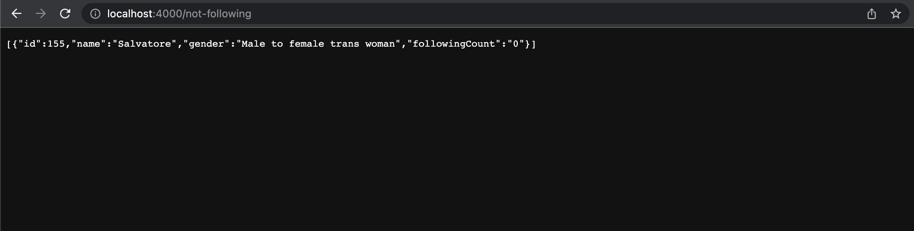

# REST-app Social Network Sim

[UA version => HERE](./README.md)

This app generates random users and connections betwenn them. You can get all users, top-following, single users by id etc. App uses Node.js, Express.js, Postgresql, Sequelize. Deployed on HerokuApp.

## Usage

1. Clone the app to local computer

```sh
HTML
$ git clone https://github.com/max-kravchenko/restApp_socialNetworkSimulator.git 
SSH
$ git clone git@github.com:max-kravchenko/restApp_socialNetworkSimulator.git
```

2. Install all dependencies
```sh
$ npm i
```

3. Add database (e.g. Postgresql). Add a config file in config dir: Username, Password (your credentials in Postgresql), Database(database name you created), host and dialect (postgres or smth different)
```sh
{
  "development": {
    "username": "",
    "password": "",
    "database": "",
    "host": "127.0.0.1",
    "dialect": "postgres"
  },
  "test": {
    "username": "",
    "password": "",
    "database": "",
    "host": "127.0.0.1",
    "dialect": "postgres"
  },
  "production": {
    "username": "",
    "password": "",
    "database": "",
    "host": "127.0.0.1",
    "dialect": "postgres"
  }
}
```

4. As you connect the database fill it with models(generated in migrations/20221118153417-init.js). User - table with users (name, gender). Subscription - table with following info (user_id (foreign key for the first table), followingUserId (id of user followed by user from table 1)).

```sh
$ npm migrate
```

5. Let's seed the base with users and random connections (seeder scripts in /seeders dir)

```sh
$ npm seed
```

6. When everything is ready, let's run our server (http://localhost:4000)

```sh
$ npm start
```

## Endpoints (with screenshots)

* **/users** gets all users with min 1 subscription
* [DEMO LINK](https://restapp-sn-simulator.herokuapp.com/users)


* **:USERid/friends?order_by=:collumn_name&order_type=:direction** gets user with friends (friends = people with mutual subscription), number of friends, list of friends (sorted by column name and DESC/ASC)
[DEMO LINK](https://restapp-sn-simulator.herokuapp.com/1/friends?order_by=name&order_type=desc)


* **/max-following** gets top-5 users with suscription count.
* [DEMO LINK](https://restapp-sn-simulator.herokuapp.com/max-following)


* **/not-following** gets users with no subscriptions
* [DEMO LINK](https://restapp-sn-simulator.herokuapp.com/not-following)

